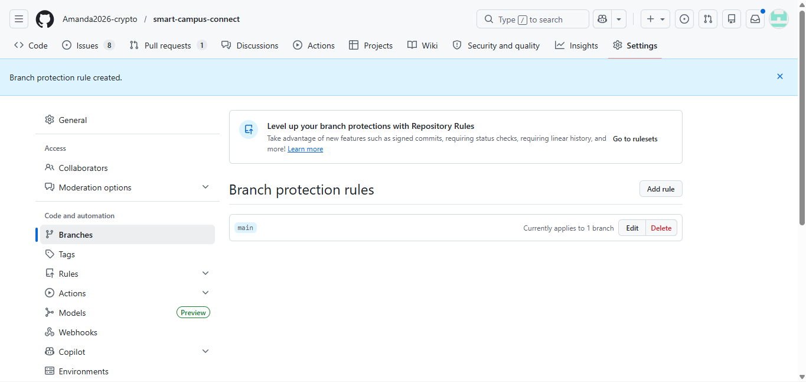

# Branch Protection Rules
---

## Why Branch Protection Matters

Branch protection rules are essential for maintaining code quality and preventing broken code from reaching the main branch. They enforce that all changes go through a review process and pass automated tests before being merged.

---

## My Branch Protection Rules for `main`

| Rule | Setting | Why |
|------|---------|-----|
| Require pull request reviews | At least 1 reviewer | Ensures code is reviewed before merging |
| Require status checks to pass | CI workflow must pass | Prevents broken code from being merged |
| Disable direct pushes | No direct commits to main | All changes must go through pull requests |
| Require branches to be up to date | Yes | Ensures PR is tested with latest main |

---

## How to Set Up These Rules

1. Go to Repository **Settings** → **Branches** → **Add branch protection rule**
2. Enter `main` as the branch name
3. Check **"Require a pull request before merging"** → Set to at least 1 reviewer
4. Check **"Require status checks to pass before merging"** → Select the CI workflow
5. Check **"Require branches to be up to date"**
6. Check **"Do not allow bypassing the above settings"**
7. Click **"Create"**

---

## Benefits of These Rules

| Benefit | Explanation |
|---------|-------------|
| **Code Quality** | No code merges without review |
| **Test Automation** | Broken code is caught before merging |
| **Team Collaboration** | PR reviews encourage knowledge sharing |
| **Release Confidence** | Main branch is always deployable |

---

## Screenshot of Branch Protection Rules

*Figure 1: GitHub branch protection rules configured for the main branch*
