# Use Case Diagram: Smart Campus Connect

## Diagram

```mermaid
graph TD
    subgraph Actors
        Student[Student]
        Faculty[Faculty Member]
        Admin[Administrator]
        ITStaff[IT Staff]
        Parent[Parent]
        Security[Campus Security]
    end
    
    subgraph System Boundary
        subgraph Academic Module
            UC1[View Grades]
            UC2[Submit Assignment]
            UC3[Take Attendance]
            UC4[Create Assignment]
        end
        
        subgraph Campus Module
            UC5[Find Study Space]
            UC6[Track Shuttle]
            UC7[View Campus Map]
        end
        
        subgraph Event Module
            UC8[Create Event]
            UC9[Register for Event]
            UC10[Approve Event]
        end
        
        subgraph Social Module
            UC11[Create Study Group]
            UC12[Send Message]
        end
        
        subgraph Other Module
            UC13[View Meal Plan]
            UC14[Report Lost Item]
            UC15[Send Emergency Alert]
        end
    end
    
    Student --> UC1
    Student --> UC2
    Student --> UC5
    Student --> UC6
    Student --> UC7
    Student --> UC9
    Student --> UC11
    Student --> UC12
    Student --> UC13
    Student --> UC14
    
    Faculty --> UC3
    Faculty --> UC4
    Faculty --> UC1
    Faculty --> UC8
    
    Admin --> UC10
    Admin --> UC15
    Admin --> UC5
    
    Security --> UC15
    Security --> UC5
    
    Parent --> UC13
    
    UC8 -.->|<<includes>>| UC9
    UC11 -.->|<<includes>>| UC12
```

---

## Written Explanation

### Key Actors and Their Roles

| Actor | Role Description |
|-------|------------------|
| **Student** | Primary user who accesses academic, campus, event, and social features. Students can view grades, submit assignments, find study spaces, track shuttles, register for events, create study groups, send messages, view meal plans, and report lost items. |
| **Faculty Member** | Academic staff who manage courses. Faculty can take attendance, create assignments, view grades, and create events for their courses. |
| **Administrator** | Staff member with oversight of campus operations. Administrators approve events, send emergency alerts, and monitor campus resources like study spaces. |
| **IT Staff** | Technical support team responsible for system maintenance, security monitoring, and handling technical issues. |
| **Parent** | Guardian with view-only access to student information. Parents can view meal plan balances and transaction history with student permission. |
| **Campus Security** | Staff responsible for campus safety. Security personnel can monitor occupancy data for buildings and send emergency alerts during incidents. |

---

### Relationships Between Actors and Use Cases

**Generalization:**
- **Parent** is a specialized actor that inherits from Student but has restricted permissions (view-only access to meal plans).
- **Campus Security** is a specialized actor that inherits from Administrator for emergency-related features.

**Inclusion Relationships (<<includes>>):**
- **Create Event** includes **Register for Event** - When a faculty member creates an event, they are automatically registered as an attendee.
- **Create Study Group** includes **Send Message** - When a study group is created, the discussion board is automatically enabled for messaging.

**Association Relationships:**
- **Student** is associated with 10 use cases: View Grades, Submit Assignment, Find Study Space, Track Shuttle, View Campus Map, Register for Event, Create Study Group, Send Message, View Meal Plan, Report Lost Item
- **Faculty** is associated with 4 use cases: View Grades, Take Attendance, Create Assignment, Create Event
- **Administrator** is associated with 3 use cases: Find Study Space, Approve Event, Send Emergency Alert
- **Campus Security** is associated with 2 use cases: Find Study Space, Send Emergency Alert
- **Parent** is associated with 1 use case: View Meal Plan

---

### How the Diagram Addresses Stakeholder Concerns from Assignment 4

| Stakeholder | Concern from Assignment 4 | Addressed By |
|-------------|---------------------------|--------------|
| **Student** | Easy access to grades and assignments | View Grades, Submit Assignment |
| **Student** | Finding empty study rooms quickly | Find Study Space |
| **Student** | Discovering relevant campus events | Register for Event |
| **Student** | Connecting with classmates for study groups | Create Study Group, Send Message |
| **Faculty** | Efficient attendance tracking | Take Attendance |
| **Faculty** | Easy assignment posting and grading | Create Assignment |
| **Faculty** | Quick communication with students | Create Event |
| **Administrator** | Efficient event approval workflow | Approve Event |
| **Administrator** | Quick emergency communication | Send Emergency Alert |
| **Administrator** | Optimal utilization of campus spaces | Find Study Space |
| **Campus Security** | Real-time campus occupancy data | Find Study Space |
| **Campus Security** | Quick emergency response | Send Emergency Alert |
| **Parent** | Monitoring meal plan balance | View Meal Plan |

---

### Traceability to Functional Requirements

| Use Case | Corresponding Functional Requirements from Assignment 4 |
|----------|--------------------------------------------------------|
| View Grades | FR-05 (Grade Viewing) |
| Submit Assignment | FR-06 (Assignment Management) |
| Take Attendance | FR-07 (Attendance Tracking) |
| Create Assignment | FR-06 (Assignment Management) |
| Find Study Space | FR-09 (Study Space Finder) |
| Track Shuttle | FR-10 (Shuttle Tracking) |
| View Campus Map | FR-08 (Interactive Campus Map) |
| Create Event | FR-11 (Event Creation and Discovery) |
| Register for Event | FR-11 (Event Creation and Discovery) |
| Approve Event | FR-12 (Event Approval Workflow) |
| Create Study Group | FR-13 (Study Group Creation) |
| Send Message | FR-14 (In-App Messaging) |
| View Meal Plan | FR-17 (Meal Plan Balance Tracking) |
| Report Lost Item | FR-15 (Lost Item Reporting) |
| Send Emergency Alert | NFR-09 (Security - Emergency Communication) |
