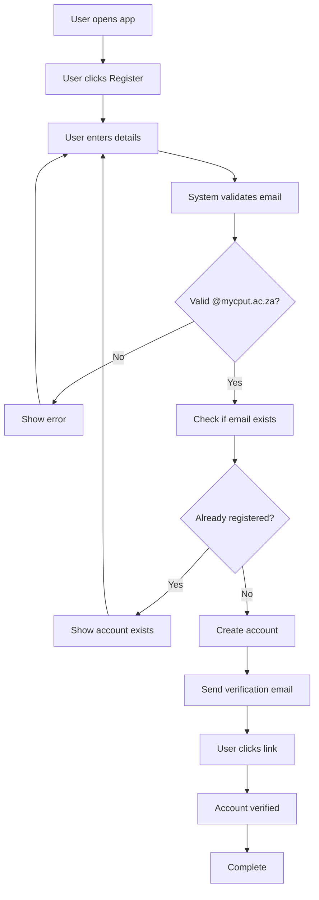
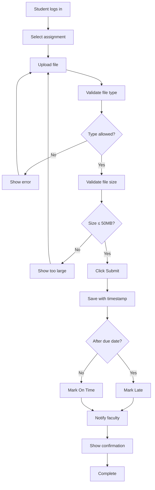
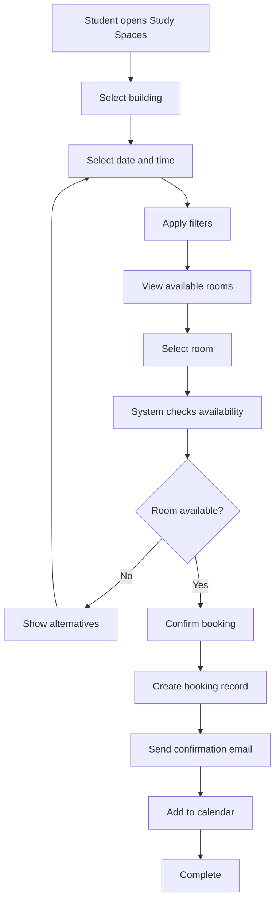
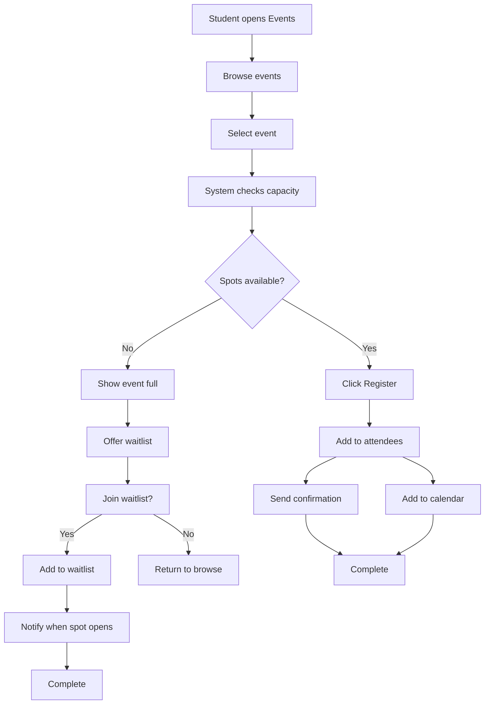
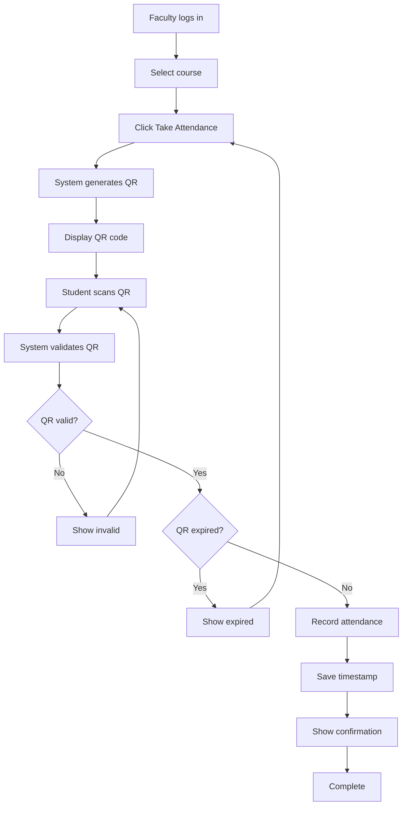
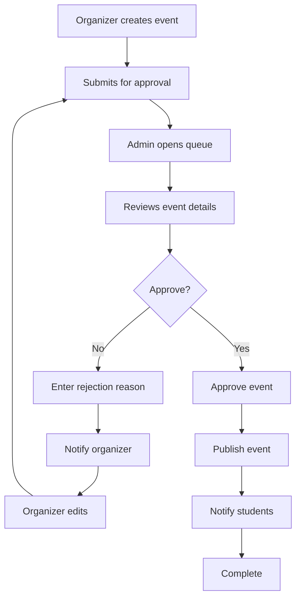
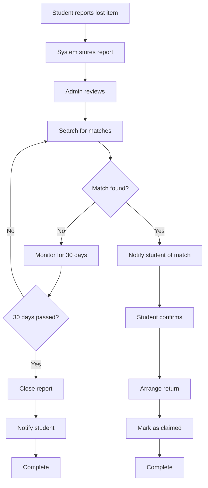
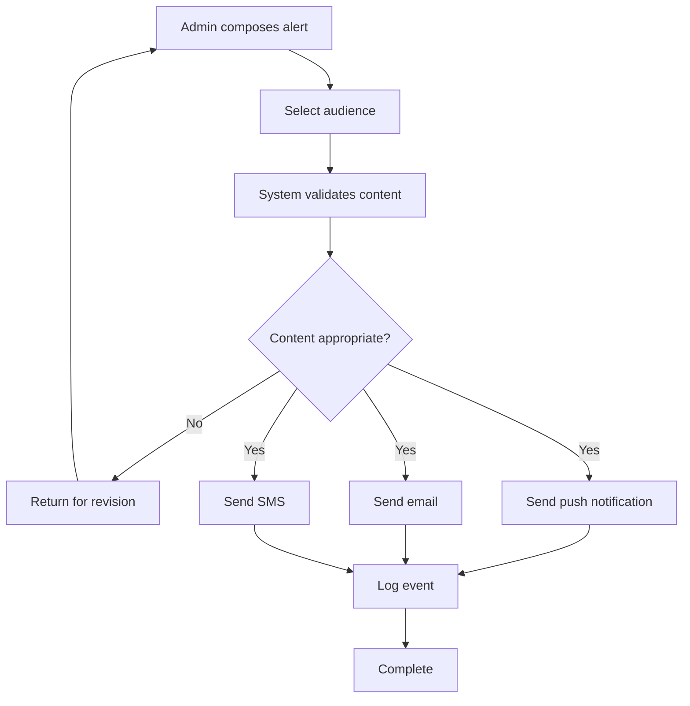

# Activity Diagrams: Smart Campus Connect

---

## Workflow 1: User Registration

### Diagram

### Explanation

| Element | Description |
|---------|-------------|
| Start Node | User opens mobile app |
| End Node | Account verified |
| Actions | Enter details, validate email, check existence, create account, send email, verify link |
| Decisions | Valid email domain? Email already registered? |
| Parallel Actions | None |
| Swimlanes | User: opens, registers, enters, verifies; System: validates, checks, creates, sends |

### Stakeholder Concerns Addressed

| Stakeholder | Concern | How Addressed |
|-------------|---------|---------------|
| Student | Easy registration | Simple form with clear errors |
| IT Staff | Security | Email domain validation |

### Traceability

| Assignment | Artifact |
|------------|----------|
| Assignment 4 | FR-01 |
| Assignment 5 | UC-001 |
| Assignment 6 | US-001 |

---

## Workflow 2: Assignment Submission

### Diagram

### Explanation

| Element | Description |
|---------|-------------|
| Start Node | Student logs in |
| End Node | Submission confirmed |
| Actions | Select, upload, validate, submit, save, check due date, notify |
| Decisions | Type allowed? Size OK? After due date? |
| Parallel Actions | None |
| Swimlanes | Student: logs in, selects, uploads, submits; System: validates, saves, checks, notifies |

### Stakeholder Concerns Addressed

| Stakeholder | Concern | How Addressed |
|-------------|---------|---------------|
| Student | No printing | Digital upload |
| Faculty | Late detection | Automatic late marking |

### Traceability

| Assignment | Artifact |
|------------|----------|
| Assignment 4 | FR-06 |
| Assignment 5 | UC-002 |
| Assignment 6 | US-006 |

---

## Workflow 3: Study Room Booking

### Diagram

### Explanation

| Element | Description |
|---------|-------------|
| Start Node | Student opens Study Spaces |
| End Node | Booking confirmed |
| Actions | Select, filter, view, select, confirm, create, send email, add to calendar |
| Decisions | Room available? |
| Parallel Actions | Send email AND add to calendar |
| Swimlanes | Student: selects, filters, confirms; System: displays, checks, creates, sends, adds |

### Stakeholder Concerns Addressed

| Stakeholder | Concern | How Addressed |
|-------------|---------|---------------|
| Student | Wasted time | Real-time availability |
| Student | Guarantee space | Booking confirmation |

### Traceability

| Assignment | Artifact |
|------------|----------|
| Assignment 4 | FR-09 |
| Assignment 5 | UC-005 |
| Assignment 6 | US-009, US-010 |

---

## Workflow 4: Event Registration

### Diagram

### Explanation

| Element | Description |
|---------|-------------|
| Start Node | Student opens Events |
| End Node | Registered or waitlisted |
| Actions | Browse, select, check capacity, register, add to attendees, send email, add to calendar |
| Decisions | Spots available? Join waitlist? |
| Parallel Actions | Send email AND add to calendar |
| Swimlanes | Student: browses, selects, registers, decides; System: checks, adds, sends, adds |

### Stakeholder Concerns Addressed

| Stakeholder | Concern | How Addressed |
|-------------|---------|---------------|
| Student | Never miss events | Calendar integration |
| Student | Full events | Waitlist option |

### Traceability

| Assignment | Artifact |
|------------|----------|
| Assignment 4 | FR-11 |
| Assignment 5 | UC-006 |
| Assignment 6 | US-012 |

---

## Workflow 5: Attendance via QR Code

### Diagram

### Explanation

| Element | Description |
|---------|-------------|
| Start Node | Faculty logs in |
| End Node | Attendance recorded |
| Actions | Select course, generate QR, display, scan, validate, record, save timestamp |
| Decisions | QR valid? QR expired? |
| Parallel Actions | None |
| Swimlanes | Faculty: logs in, selects, generates, displays; Student: scans; System: generates, validates, records, saves |

### Stakeholder Concerns Addressed

| Stakeholder | Concern | How Addressed |
|-------------|---------|---------------|
| Faculty | Time wasted | QR automation |
| Student | Privacy | Only ID recorded |

### Traceability

| Assignment | Artifact |
|------------|----------|
| Assignment 4 | FR-07 |
| Assignment 5 | UC-003 |
| Assignment 6 | US-008 |

---

## Workflow 6: Event Approval (Admin)

### Diagram

### Explanation

| Element | Description |
|---------|-------------|
| Start Node | Organizer creates event |
| End Node | Event published or returned |
| Actions | Create, submit, review, approve/reject, publish, notify |
| Decisions | Approve? |
| Parallel Actions | None |
| Swimlanes | Organizer: creates, submits, edits; Admin: reviews, approves/rejects; System: notifies |

### Stakeholder Concerns Addressed

| Stakeholder | Concern | How Addressed |
|-------------|---------|---------------|
| Admin | Quality control | Approval step |
| Organizer | Clear feedback | Rejection reason |

### Traceability

| Assignment | Artifact |
|------------|----------|
| Assignment 4 | FR-12 |
| Assignment 5 | UC-008 |
| Assignment 6 | US-016 |

---

## Workflow 7: Lost Item Claim

### Diagram

### Explanation

| Element | Description |
|---------|-------------|
| Start Node | Student reports lost item |
| End Node | Claimed or closed |
| Actions | Report, store, review, search, match, notify, confirm, return, claim |
| Decisions | Match found? 30 days passed? |
| Parallel Actions | None |
| Swimlanes | Student: reports, confirms; Admin: reviews, searches; System: stores, notifies, tracks |

### Stakeholder Concerns Addressed

| Stakeholder | Concern | How Addressed |
|-------------|---------|---------------|
| Student | Recover items | Match notification |
| Student | Closure | 30-day expiration |

### Traceability

| Assignment | Artifact |
|------------|----------|
| Assignment 4 | FR-15, FR-16 |
| Assignment 6 | US-018 |

---

## Workflow 8: Emergency Alert

### Diagram

### Explanation

| Element | Description |
|---------|-------------|
| Start Node | Admin composes alert |
| End Node | Alert sent and logged |
| Actions | Compose, select audience, validate, send notifications, log |
| Decisions | Content appropriate? |
| Parallel Actions | Push, email, SMS all send simultaneously |
| Swimlanes | Admin: composes, selects; System: validates, sends, logs |

### Stakeholder Concerns Addressed

| Stakeholder | Concern | How Addressed |
|-------------|---------|---------------|
| Admin | Quick communication | Multiple channels |
| Security | Reach all users | Audience selection |

### Traceability

| Assignment | Artifact |
|------------|----------|
| Assignment 4 | NFR-09 |
| Assignment 6 | US-019 |
