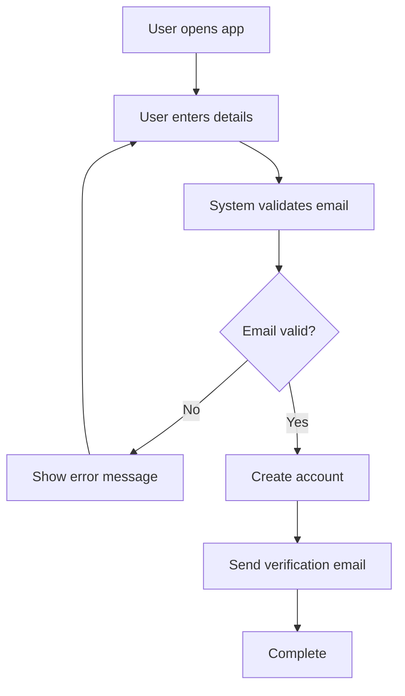
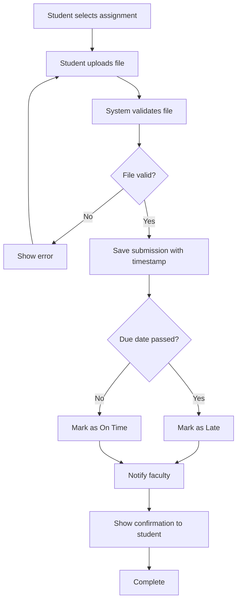
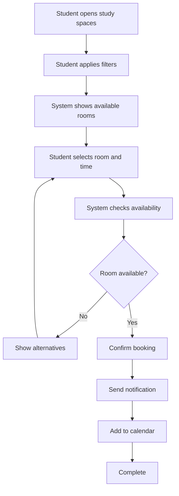
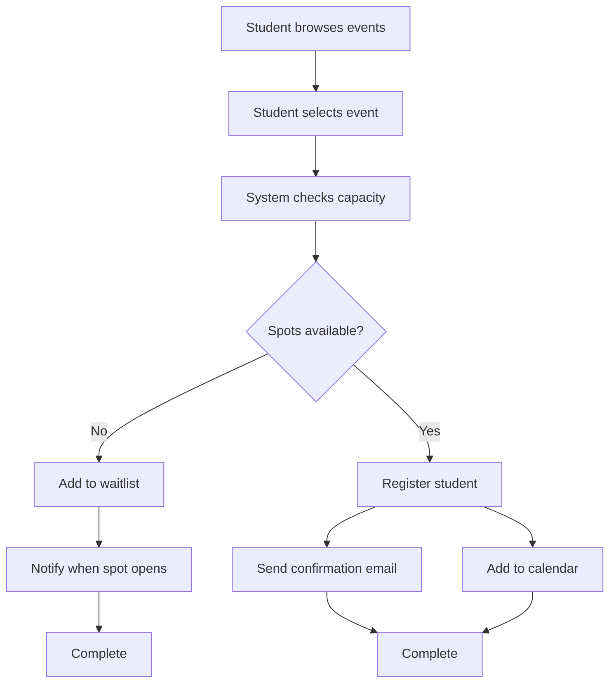
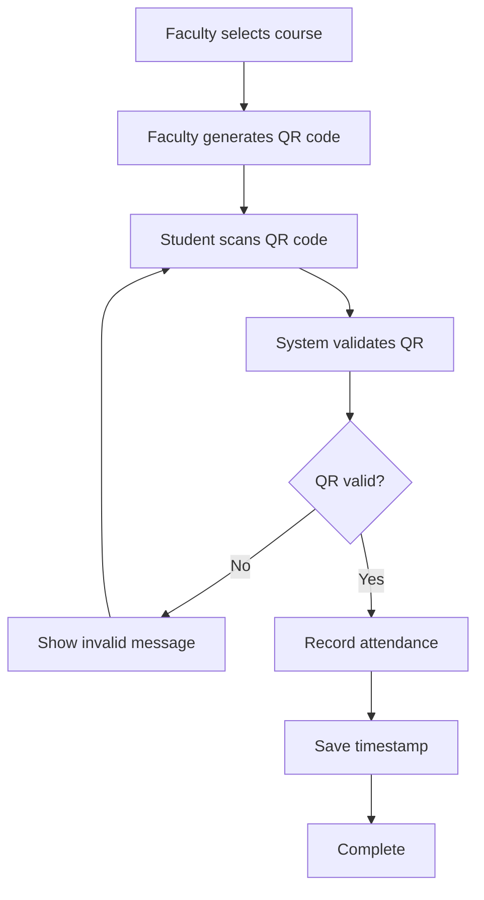
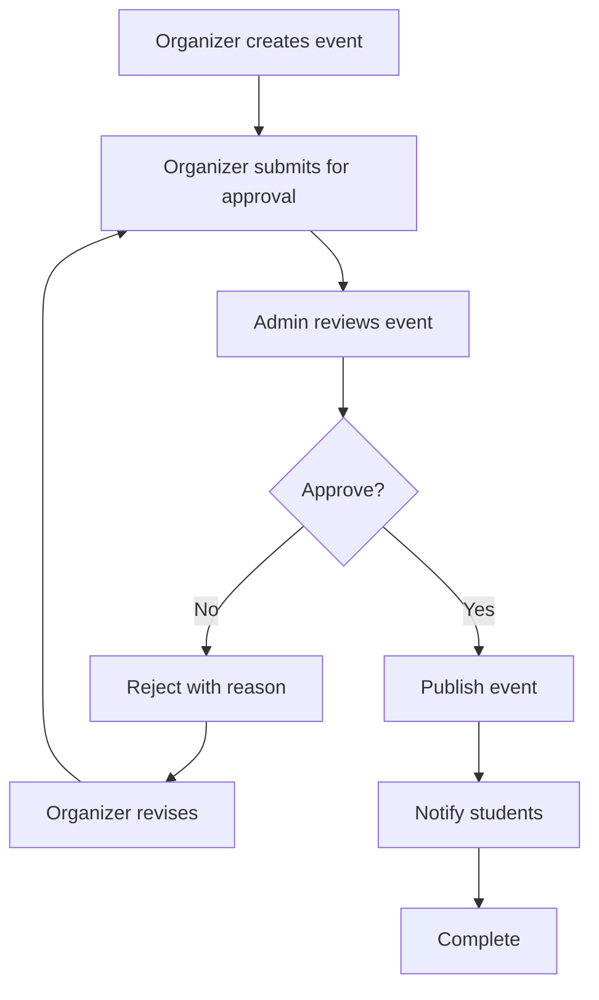
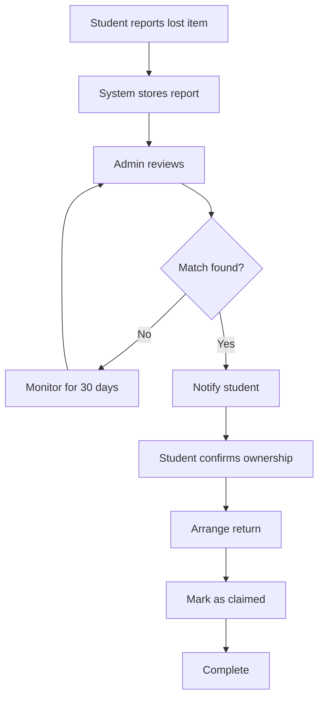
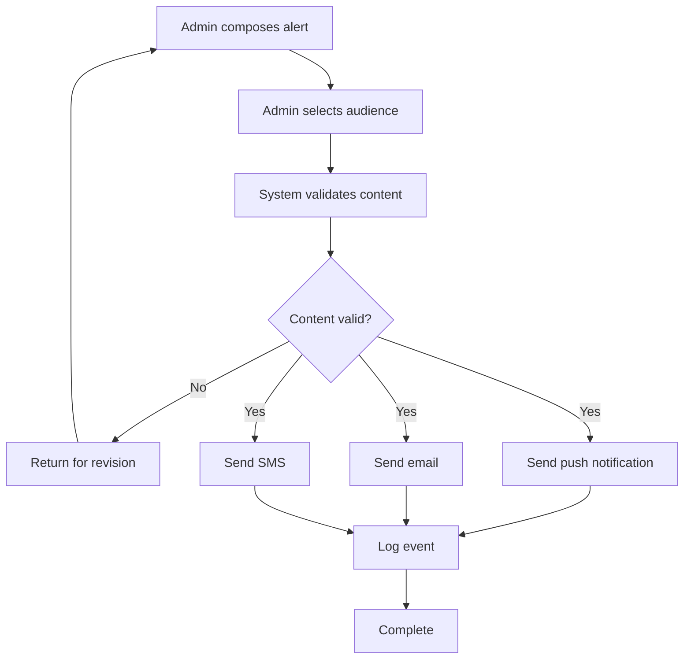

**Click "Commit new file"**

---
```markdown
# Activity Diagrams: Smart Campus Connect

---

## Workflow 1: User Registration


Swimlanes: User, System

Steps:

User opens app and enters registration details

System validates email format (@mycput.ac.za)

If invalid, error shown and user re-enters

If valid, account created and verification email sent

FR-01, US-001

Workflow 2: Assignment Submission


Swimlanes: Student, System

Steps:

Student selects assignment and uploads file

System validates file type and size

If invalid, error shown

If valid, submission saved with timestamp

System checks due date and marks as On Time or Late

Faculty notified, student confirmed

FR-06, UC-02, US-006

Workflow 3: Study Room Booking


Swimlanes: Student, System

Steps:

Student applies filters (building, time, capacity)

System displays available rooms (color-coded)

Student selects room and time slot

System checks availability

If unavailable, shows alternatives

If available, confirms booking and sends notification

FR-09, UC-05, US-009, US-010

Workflow 4: Event Registration


Swimlanes: Student, System

Steps:

Student browses and selects event

System checks capacity

If full, student added to waitlist

If available, student registered

Parallel: Send email + Add to calendar

FR-11, UC-06, US-012

Workflow 5: Attendance via QR Code


Swimlanes: Faculty, Student, System

Steps:

Faculty generates QR code

Student scans code using app

System validates QR code

If invalid, error shown and student rescans

If valid, attendance recorded with timestamp

FR-07, UC-03, US-008

Workflow 6: Event Approval (Admin)


Swimlanes: Organizer, Admin, System

Steps:

Organizer creates and submits event

Admin reviews for policy compliance

If rejected, reason sent to organizer for revision

If approved, event published and students notified

FR-12, UC-08, US-016

Workflow 7: Lost Item Claim


Swimlanes: Student, System, Admin

Steps:

Student reports lost item with photo and location

Admin reviews and searches for matches

If match found, student notified

Student confirms ownership and arranges pickup

Item marked as claimed

FR-15, FR-16, US-018

Workflow 8: Emergency Alert


Swimlanes: Admin, System

Steps:

Admin composes emergency alert

System validates content

If invalid, returned for revision

If valid, parallel notifications sent (push, email, SMS)

Event logged for audit

US-019, NFR-09

Summary: Workflows and Traceability
Workflow	FR	UC	User Story
User Registration	FR-01	-	US-001
Assignment Submission	FR-06	UC-02	US-006
Study Room Booking	FR-09	UC-05	US-009, US-010
Event Registration	FR-11	UC-06	US-012
Attendance via QR	FR-07	UC-03	US-008
Event Approval	FR-12	UC-08	US-016
Lost Item Claim	FR-15, FR-16	-	US-018
Emergency Alert	NFR-09	-	US-019


