# Class Diagram: Smart Campus Connect

**Assignment 9**
**Amanda**
**April 23, 2026**

---

## Diagram

```mermaid
classDiagram
    %% User Inheritance Hierarchy
    class User {
        <<abstract>>
        - userId: String
        - email: String
        - passwordHash: String
        - firstName: String
        - lastName: String
        - role: Enum
        - createdAt: DateTime
        - isActive: Boolean
        + register() Boolean
        + login() Boolean
        + updateProfile() Boolean
        + deactivate() Boolean
    }

    class Student {
        - studentId: String
        - department: String
        - graduationYear: Integer
        + enrollInCourse(courseId: String) Boolean
        + submitAssignment(assignmentId: String, file: File) Boolean
        + bookStudyRoom(roomId: String, startTime: DateTime, endTime: DateTime) Boolean
        + registerForEvent(eventId: String) Boolean
        + createStudyGroup(name: String, courseId: String) Boolean
        + reportLostItem(title: String, description: String) Boolean
        + viewMealPlan() MealPlan
    }

    class Faculty {
        - staffId: String
        - department: String
        - officeLocation: String
        + createCourse(courseDetails: Course) Boolean
        + createAssignment(courseId: String, assignmentDetails: Assignment) Boolean
        + takeAttendance(courseId: String, date: Date, studentIds: List~String~) Boolean
        + gradeSubmission(submissionId: String, score: Integer, feedback: String) Boolean
        + createEvent(eventDetails: Event) Boolean
    }

    class Admin {
        - staffId: String
        - adminRole: String
        + approveEvent(eventId: String, decision: Boolean, reason: String) Boolean
        + suspendUser(userId: String, reason: String) Boolean
        + sendEmergencyAlert(title: String, message: String, audience: String) Boolean
        + manageResources(resourceType: String, action: String) Boolean
    }

    %% Academic Entities
    class Course {
        - courseId: String
        - courseName: String
        - credits: Integer
        - department: String
        - facultyId: String
        - semester: String
        - maxStudents: Integer
        + addStudent(studentId: String) Boolean
        + removeStudent(studentId: String) Boolean
        + updateDetails() Boolean
    }

    class Enrollment {
        - enrollmentId: String
        - studentId: String
        - courseId: String
        - enrolledAt: DateTime
        - status: Enum
        - grade: String
        + drop() Boolean
        + complete() Boolean
    }

    class Assignment {
        - assignmentId: String
        - courseId: String
        - title: String
        - description: Text
        - dueDate: DateTime
        - maxPoints: Integer
        - allowedFileTypes: String[]
        + publish() Boolean
        + updateDeadline(newDate: DateTime) Boolean
        + acceptSubmission(studentId: String, file: File) Boolean
    }

    class Submission {
        - submissionId: String
        - assignmentId: String
        - studentId: String
        - fileUrl: String
        - submittedAt: DateTime
        - isLate: Boolean
        - score: Integer
        - feedback: Text
        + submit() Boolean
        + grade(score: Integer, feedback: String) Boolean
        + resubmit(file: File) Boolean
    }

    class Attendance {
        - attendanceId: String
        - studentId: String
        - courseId: String
        - classDate: Date
        - status: Enum
        - recordedAt: DateTime
        + markPresent(studentId: String) Boolean
        + generateReport(courseId: String) Report
    }

    %% Campus Entities
    class StudyRoom {
        - roomId: String
        - building: String
        - capacity: Integer
        - amenities: String[]
        - isAvailable: Boolean
        - hours: String
        + checkAvailability(startTime: DateTime, endTime: DateTime) Boolean
        + releaseRoom(bookingId: String) Boolean
    }

    class Booking {
        - bookingId: String
        - roomId: String
        - studentId: String
        - startTime: DateTime
        - endTime: DateTime
        - status: Enum
        - qrCode: String
        + confirm() Boolean
        + cancel() Boolean
    }

    %% Event Entities
    class Event {
        - eventId: String
        - title: String
        - description: Text
        - startTime: DateTime
        - endTime: DateTime
        - location: String
        - organizerId: String
        - maxAttendees: Integer
        - status: Enum
        + submitForApproval() Boolean
        + approve() Boolean
        + reject(reason: String) Boolean
    }

    class EventRegistration {
        - registrationId: String
        - eventId: String
        - studentId: String
        - registeredAt: DateTime
        - attended: Boolean
        + register() Boolean
        + cancel() Boolean
        + checkIn() Boolean
    }

    %% Social Entities
    class StudyGroup {
        - groupId: String
        - name: String
        - courseId: String
        - createdBy: String
        - maxMembers: Integer
        - isActive: Boolean
        - createdAt: DateTime
        + addMember(studentId: String) Boolean
        + removeMember(studentId: String) Boolean
        + disband() Boolean
    }

    class Message {
        - messageId: String
        - groupId: String
        - senderId: String
        - content: Text
        - sentAt: DateTime
        - isEdited: Boolean
        + send() Boolean
        + edit(newContent: Text) Boolean
        + delete() Boolean
    }

    %% Lost and Found Entities
    class LostItem {
        - itemId: String
        - reporterId: String
        - title: String
        - description: Text
        - category: String
        - locationLost: String
        - dateLost: Date
        - photoUrl: String
        - status: Enum
        + report() Boolean
        + markFound(matchId: String) Boolean
        + claim() Boolean
    }

    class FoundItem {
        - foundId: String
        - reporterId: String
        - title: String
        - description: Text
        - category: String
        - locationFound: String
        - dateFound: Date
        - photoUrl: String
        - storageLocation: String
        - status: Enum
        + report() Boolean
        + matchWithLost() List~LostItem~
        + markClaimed(ownerId: String) Boolean
    }

    %% Meal Plan Entities
    class MealPlan {
        - planId: String
        - studentId: String
        - totalSwipes: Integer
        - remainingSwipes: Integer
        - diningDollars: Decimal
        - startDate: Date
        - endDate: Date
        - isActive: Boolean
        + deductSwipe() Boolean
        + addFunds(amount: Decimal) Boolean
        + checkBalance() Integer
    }

    class Transaction {
        - transactionId: String
        - planId: String
        - amount: Decimal
        - type: Enum
        - description: String
        - location: String
        - timestamp: DateTime
        + record() Boolean
        + refund() Boolean
    }

    %% Shuttle Entities
    class Shuttle {
        - shuttleId: String
        - route: String
        - capacity: Integer
        - isActive: Boolean
        + updateLocation(lat: Double, lon: Double) Boolean
        + reportDelay(minutes: Integer) Boolean
    }

    class ShuttleLocation {
        - locationId: String
        - shuttleId: String
        - latitude: Double
        - longitude: Double
        - speed: Integer
        - heading: Integer
        - timestamp: DateTime
        - status: Enum
        + update() Boolean
    }

    class Notification {
        - notificationId: String
        - userId: String
        - title: String
        - body: Text
        - type: Enum
        - isRead: Boolean
        - createdAt: DateTime
        - data: JSON
        + send() Boolean
        + markAsRead() Boolean
    }

    %% Inheritance Relationships
    Student --|> User
    Faculty --|> User
    Admin --|> User

    %% Academic Relationships
    Faculty "1" --> "*" Course : teaches
    Student "*" --> "*" Course : enrolls in
    Enrollment "0..*" --> "1" Student : belongs to
    Enrollment "0..*" --> "1" Course : references
    Course "1" --> "*" Assignment : has
    Assignment "1" --> "*" Submission : receives
    Student "1" --> "*" Submission : submits
    Course "1" --> "*" Attendance : records
    Student "1" --> "*" Attendance : has

    %% Campus Relationships
    Student "1" --> "*" Booking : makes
    StudyRoom "1" --> "*" Booking : has
    Booking "1" --> "1" StudyRoom : books
    Booking "1" --> "1" Student : made by

    %% Event Relationships
    Faculty "1" --> "*" Event : creates
    Student "*" --> "*" Event : registers for
    EventRegistration "0..*" --> "1" Student : belongs to
    EventRegistration "0..*" --> "1" Event : references

    %% Social Relationships
    Student "1" --> "*" StudyGroup : creates
    StudyGroup "1" --> "*" Message : contains
    Student "1" --> "*" Message : sends

    %% Lost and Found Relationships
    Student "1" --> "*" LostItem : reports
    User "1" --> "*" FoundItem : reports

    %% Meal Plan Relationships
    Student "1" --> "1" MealPlan : has
    MealPlan "1" --> "*" Transaction : generates

    %% Shuttle Relationships
    Shuttle "1" --> "*" ShuttleLocation : tracked by

    %% Notification Relationships
    User "1" --> "*" Notification : receives
```

# Key Design Decisions

## Decision 1: Abstract User Class with Inheritance
**Decision:**  
Created an abstract `User` class with three concrete subclasses: `Student`, `Faculty`, and `Admin`.

**Rationale:**  
All user types share common attributes (`userId`, `email`, `passwordHash`) and methods (`register`, `login`). Using inheritance eliminates redundancy and follows object-oriented principles. This aligns with **FR-03 (Role-Based Access)** from Assignment 4.

---

## Decision 2: Separate Enrollment Class
**Decision:**  
Used a separate `Enrollment` class instead of a direct many-to-many relationship between `Student` and `Course`.

**Rationale:**  
The enrollment relationship has its own attributes (`grade`, `status`, `enrolledAt`) and methods (`drop`, `complete`). This follows database normalization and UML best practices for association classes.

---

## Decision 3: Bidirectional Relationships Where Needed
**Decision:**  
Used bidirectional relationships for `Booking ↔ StudyRoom` and `Enrollment ↔ Course`.

**Rationale:**  

- From Room to Bookings → Check availability  
- From Booking to Room → Display room details  
- From Course to Enrollments → View roster  
- From Student to Enrollments → View enrolled courses  

---

## Decision 4: Composition for Shuttle Tracking
**Decision:**  
Used composition (solid diamond) between `Shuttle` and `ShuttleLocation`.

**Rationale:**  
A `ShuttleLocation` has no meaning without its parent `Shuttle`. If a Shuttle is removed, its location history is also deleted. This follows the **whole-part relationship** where the part cannot exist independently.

---

## Decision 5: Multiplicity Constraints
**Decision:**  
Applied precise multiplicity constraints based on business rules.

| Relationship | Multiplicity | Business Rule |
|-------------|-------------|---------------|
| Faculty → Course | 1 → * | A Course must have exactly one Faculty |
| Student → Enrollment | 1 → * | A Student can enroll in many Courses |
| StudyRoom → Booking | 1 → 0..* | A Room can have multiple Bookings over time |

---

## Decision 6: Method Signatures
**Decision:**  
Included parameter types and return types in method signatures.

**Rationale:**  
Provides clarity for implementation and follows UML standards.  
Example:
This shows the method takes a course ID and returns a success status.

---

# Alignment with Prior Assignments

## Assignment 4: Functional Requirements

| Requirement | Class / Method |
|------------|----------------|
| FR-01 (User Registration) | `User.register()` |
| FR-02 (User Authentication) | `User.login()` |
| FR-04 (Course Enrollment) | `Student.enrollInCourse()` |
| FR-05 (Grade Viewing) | `Enrollment.grade` |
| FR-06 (Assignment Management) | `Assignment`, `Submission` |
| FR-07 (Attendance Tracking) | `Attendance` |
| FR-09 (Study Space Finder) | `StudyRoom.checkAvailability()`, `Booking` |
| FR-10 (Shuttle Tracking) | `Shuttle`, `ShuttleLocation` |
| FR-11 (Event Discovery) | `Event`, `EventRegistration` |
| FR-13 (Study Groups) | `StudyGroup`, `Message` |
| FR-15/16 (Lost/Found) | `LostItem`, `FoundItem` |
| FR-17 (Meal Plan) | `MealPlan`, `Transaction` |

---

## Assignment 5: Use Cases

| Use Case | Class Methods |
|----------|--------------|
| UC-001 (Register Account) | `User.register()` |
| UC-002 (Submit Assignment) | `Submission.submit()` |
| UC-003 (Take Attendance) | `Attendance.markPresent()` |
| UC-004 (Create Assignment) | `Faculty.createAssignment()` |
| UC-005 (Find Study Space) | `StudyRoom.checkAvailability()` |
| UC-006 (Register Event) | `EventRegistration.register()` |
| UC-007 (Create Study Group) | `Student.createStudyGroup()` |
| UC-008 (Approve Event) | `Admin.approveEvent()` |

---

## Assignment 8: State Diagrams

| State Diagram | Corresponding Class |
|--------------|--------------------|
| User Account | `User` (status attribute) |
| Assignment Submission | `Submission` (status: draft, submitted, late, graded) |
| Study Room Booking | `Booking` (status: pending, confirmed, cancelled) |
| Event | `Event` (status: draft, submitted, approved, published) |
| Meal Plan Transaction | `Transaction` (status: initiated, authorized, completed) |
| Lost Item Report | `LostItem` (status: reported, investigating, found, claimed) |
| Study Group | `StudyGroup` (status: forming, active, archived) |
| Shuttle Location | `ShuttleLocation` (status: scheduled, approaching, atStop) |
