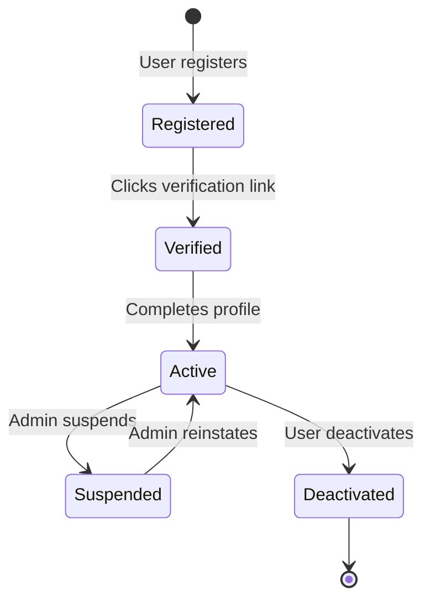
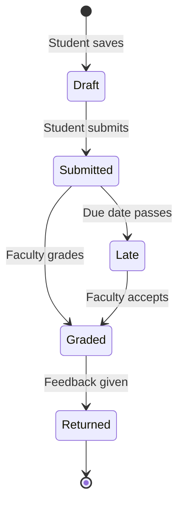
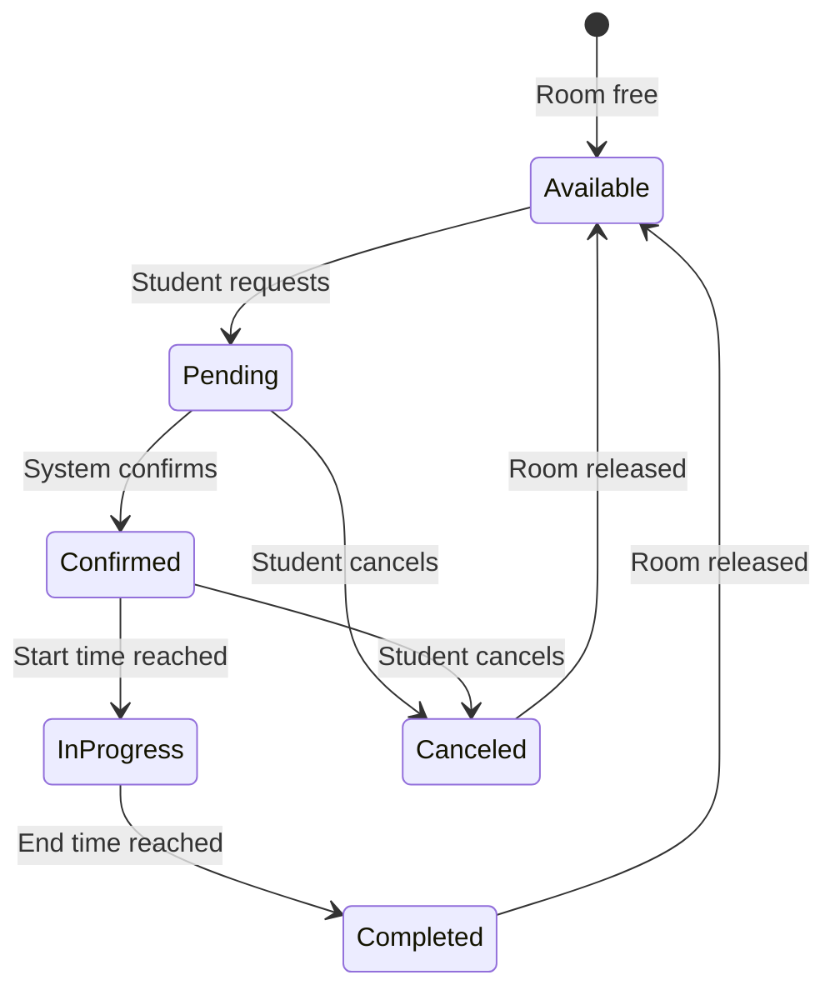
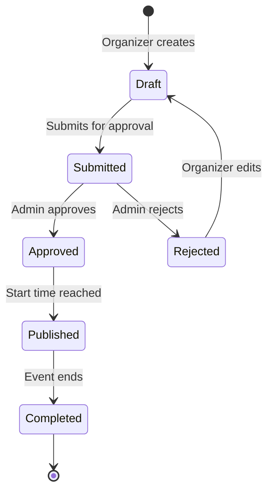
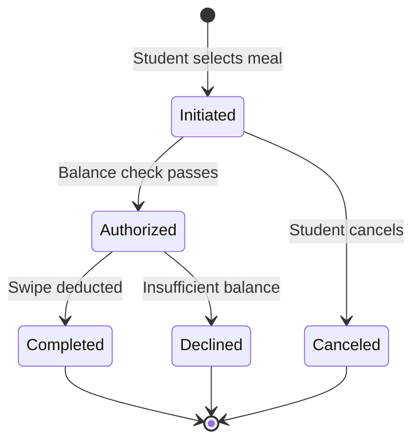
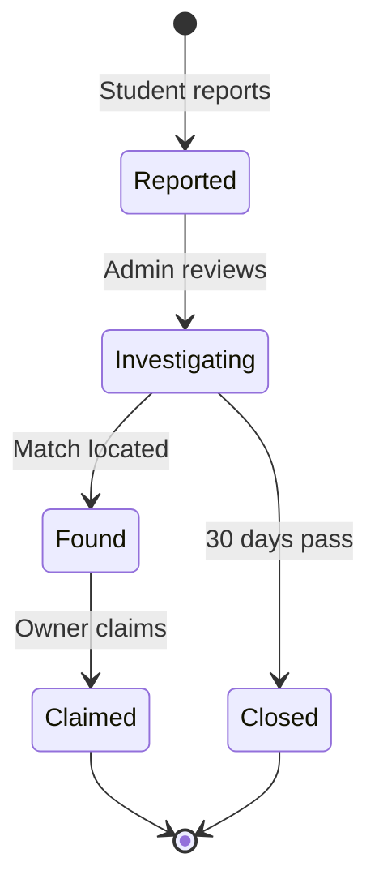
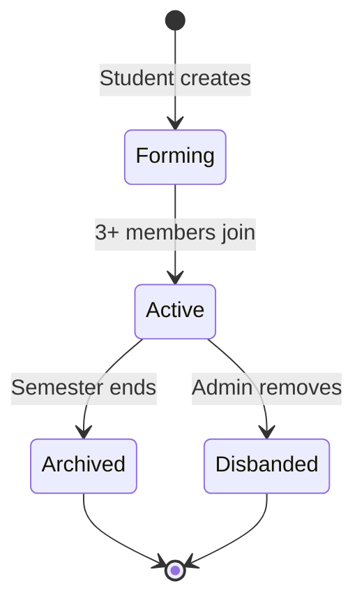
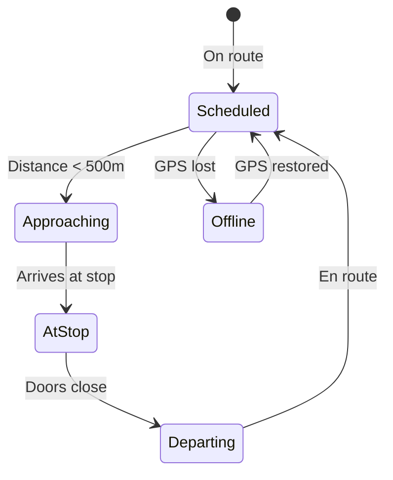

# State Transition Diagrams: Smart Campus Connect

---

## Object 1: User Account

States: Registered, Verified, Active, Suspended, Deactivated

Transitions:

From	To	Event
Registered	Verified	Email verification
Verified	Active	Profile completion
Active	Suspended	Admin action
Active	Deactivated	User action
FR-01, FR-02, FR-03: User registration and authentication lifecycle.

Object 2: Assignment Submission

States: Draft, Submitted, Late, Graded, Returned

Transitions:

From	To	Event
Draft	Submitted	Submit button
Submitted	Late	Due date reached
Submitted	Graded	Grade entered
Late	Graded	Faculty override
FR-06, UC-02: Assignment submission lifecycle.

Object 3: Study Room Booking

States: Available, Pending, Confirmed, InProgress, Completed, Canceled

Transitions:

From	To	Event
Available	Pending	Booking request
Pending	Confirmed	Conflict check passes
Confirmed	InProgress	Start time
InProgress	Completed	End time
FR-09, UC-05: Study room booking lifecycle.

Object 4: Event

States: Draft, Submitted, Approved, Rejected, Published, Completed

Transitions:

From	To	Event
Draft	Submitted	Submit button
Submitted	Approved	Admin approves
Submitted	Rejected	Admin rejects
Rejected	Draft	Organizer edits
FR-11, FR-12, UC-08: Event management lifecycle.

Object 5: Meal Plan Transaction

States: Initiated, Authorized, Completed, Declined, Canceled

Transitions:

From	To	Event	Guard
Initiated	Authorized	Check balance	Balance ≥ swipe value
Authorized	Completed	Deduct swipe	-
Authorized	Declined	Check fails	Balance < swipe value
FR-17: Meal plan transaction lifecycle.

Object 6: Lost Item Report

States: Reported, Investigating, Found, Claimed, Closed

Transitions:

From	To	Event
Reported	Investigating	Admin assigns
Investigating	Found	Match found
Investigating	Closed	Expiration
Found	Claimed	Owner verified
FR-15, FR-16: Lost and found lifecycle.

Object 7: Study Group

States: Forming, Active, Archived, Disbanded

Transitions:

From	To	Event	Guard
Forming	Active	Members join	Count ≥ 3
Active	Archived	Semester end	Date > semester end
Active	Disbanded	Admin action	Policy violation
FR-13, FR-14, UC-07: Study group lifecycle.

Object 8: Shuttle Location

States: Scheduled, Approaching, AtStop, Departing, Offline

Transitions:

From	To	Event	Guard
Scheduled	Approaching	GPS update	Distance < 500m
Approaching	AtStop	Arrival	Speed = 0
AtStop	Departing	Timer	30 seconds passed
Scheduled	Offline	Signal loss	10 seconds no signal
FR-10: Shuttle tracking lifecycle.

Summary: Objects and Requirements Traceability
Object	Functional Requirements	Use Cases	User Stories
User Account	FR-01, FR-02, FR-03	-	US-001, US-002, US-003
Assignment Submission	FR-06	UC-02	US-006
Study Room Booking	FR-09	UC-05	US-009, US-010
Event	FR-11, FR-12	UC-06, UC-08	US-012, US-016
Meal Plan Transaction	FR-17	-	US-017
Lost Item Report	FR-15, FR-16	-	US-018
Study Group	FR-13, FR-14	UC-07	US-013, US-014
Shuttle Location	FR-10	-	US-011
