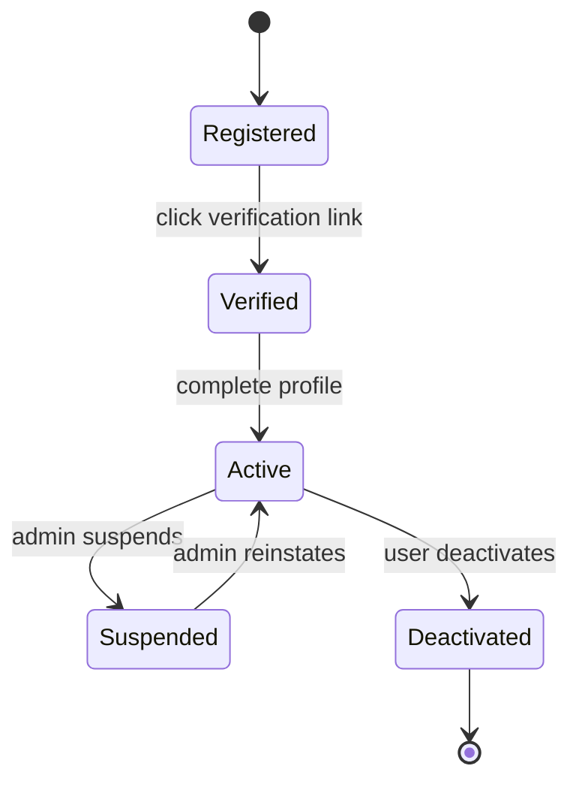
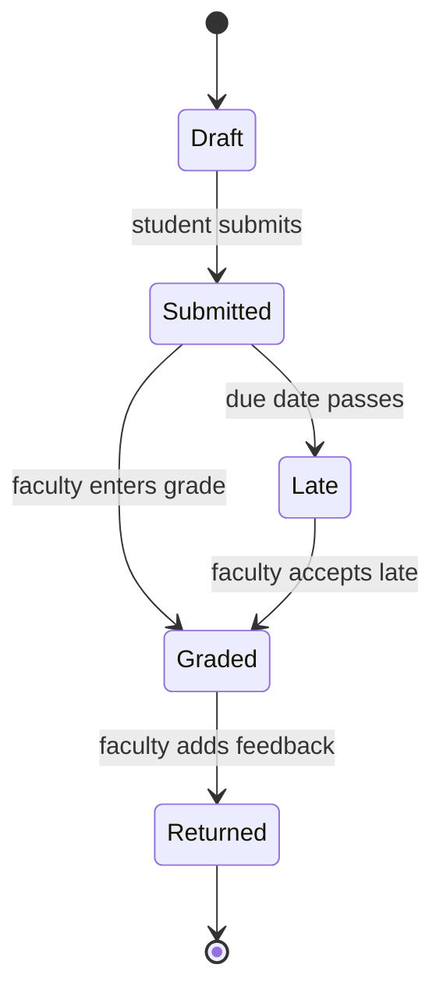
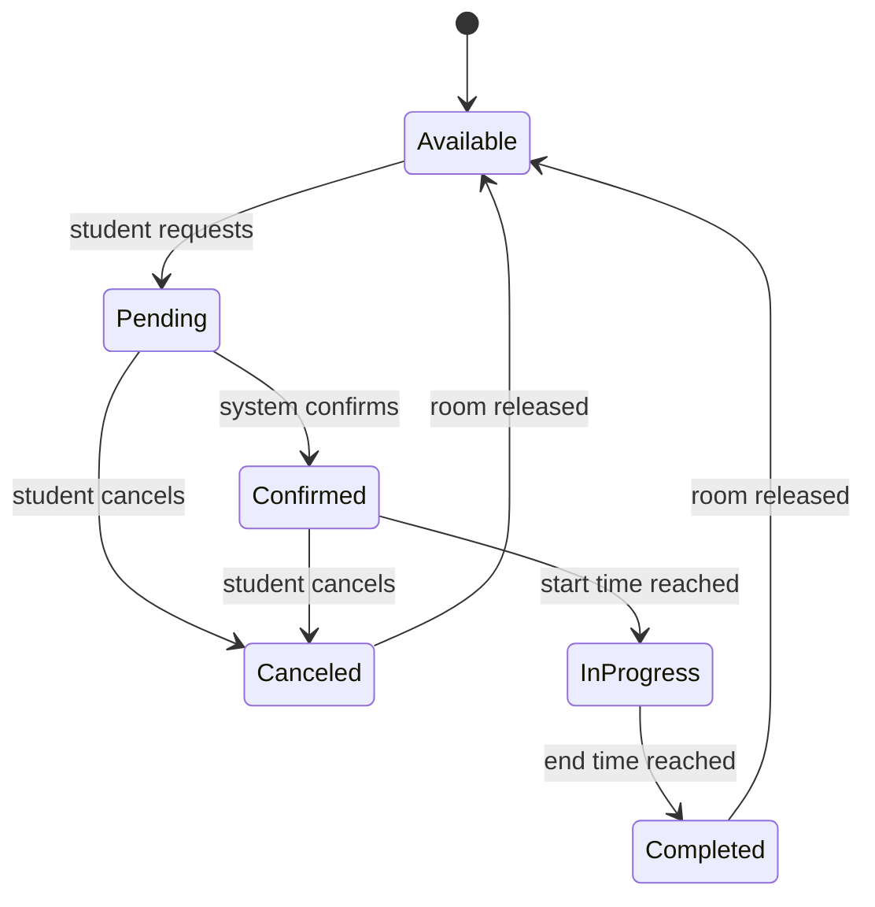
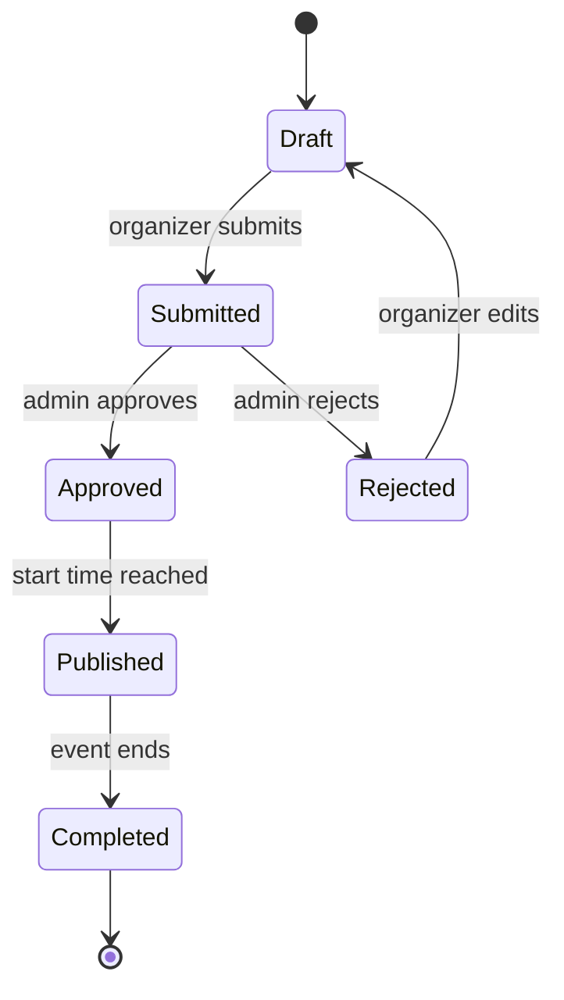
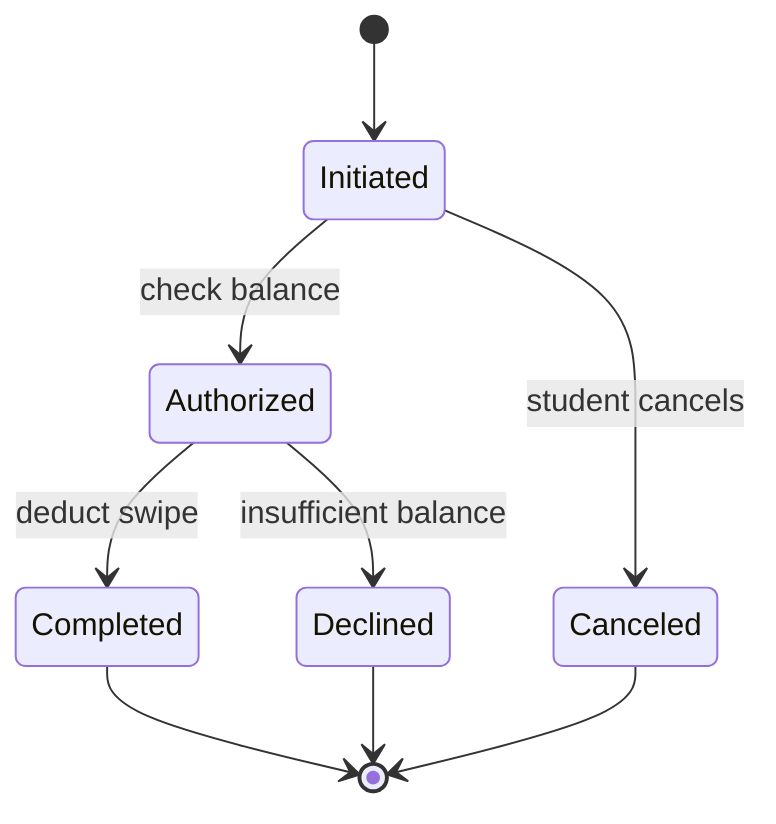
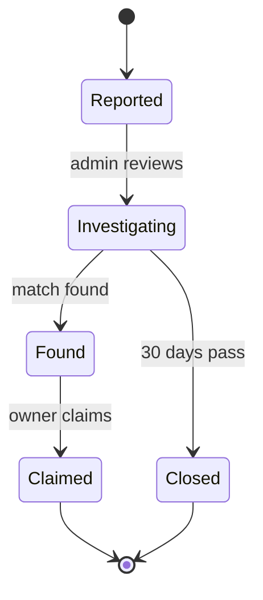
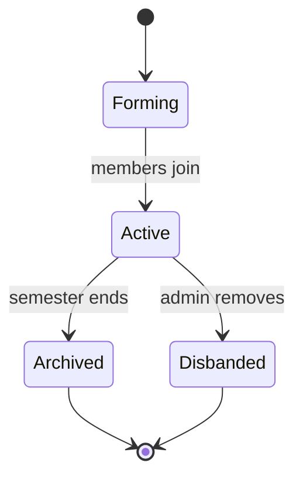
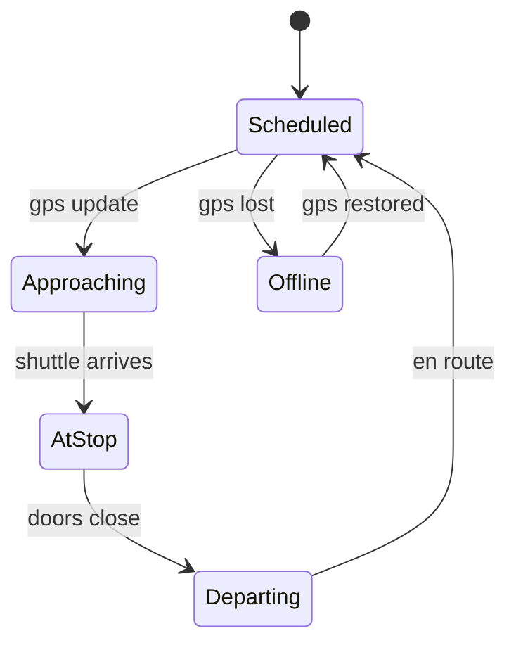

# State Transition Diagrams: Smart Campus Connect

**Assignment 8**
**Amanda**
**April 17, 2026**

---

## Object 1: User Account

### Diagram

### Key States

| State | Description |
|-------|-------------|
| Registered | User created account but email not verified |
| Verified | Email confirmed but profile incomplete |
| Active | Full access to system features |
| Suspended | Temporarily blocked by administrator |
| Deactivated | User voluntarily closed account |

### Transitions

| From | To | Event | Guard Condition |
|------|-----|-------|-----------------|
| Registered | Verified | Click verification link | Link not expired (24 hours) |
| Verified | Active | Complete profile | All required fields filled |
| Active | Suspended | Admin suspends account | Violation detected |
| Active | Deactivated | User deactivates account | User confirms |
| Suspended | Active | Admin reinstates account | Violation resolved |

### Traceability to Functional Requirements (Assignment 4)

| Requirement | Description |
|-------------|-------------|
| FR-01 | User Registration |
| FR-02 | User Authentication |
| FR-03 | Role-Based Access |

### Traceability to User Stories (Assignment 6)

| User Story | Description |
|------------|-------------|
| US-001 | Student Registration |
| US-002 | Student Login |
| US-003 | Faculty Login |

---

## Object 2: Assignment Submission

### Diagram

### Key States

| State | Description |
|-------|-------------|
| Draft | Work saved but not officially submitted |
| Submitted | Assignment submitted before or on due date |
| Late | Assignment submitted after due date |
| Graded | Faculty has assigned a score |
| Returned | Student has received grade and feedback |

### Transitions

| From | To | Event | Guard Condition |
|------|-----|-------|-----------------|
| Draft | Submitted | Student clicks Submit | File uploaded and validated |
| Submitted | Late | Due date passes | Current date > due date |
| Submitted | Graded | Faculty enters grade | Grade between 0 and max points |
| Late | Graded | Faculty accepts late | Faculty discretion |

### Traceability

| Requirement | Mapping |
|-------------|---------|
| FR-06 (Assignment Management) | Complete lifecycle |
| UC-002 (Submit Assignment) | Draft to Submitted |
| US-006 (Submit assignments online) | Full workflow |

---

## Object 3: Study Room Booking

### Diagram

### Key States

| State | Description |
|-------|-------------|
| Available | Room is free to book |
| Pending | Booking request awaiting confirmation |
| Confirmed | Booking is locked and scheduled |
| InProgress | Current time is within booking window |
| Completed | Booking period has ended |
| Canceled | Booking was cancelled |

### Transitions

| From | To | Event | Guard Condition |
|------|-----|-------|-----------------|
| Available | Pending | Student requests booking | Time slot is free |
| Pending | Confirmed | System confirms | No conflicts; max 3 hours |
| Pending | Canceled | Student cancels | - |
| Confirmed | InProgress | Start time reached | Current time >= start |
| Confirmed | Canceled | Student cancels | Before start time |
| InProgress | Completed | End time reached | Current time >= end |

### Traceability

| Requirement | Mapping |
|-------------|---------|
| FR-09 (Study Space Finder) | Available to Confirmed |
| UC-005 (Find Study Space) | Complete booking flow |
| US-009, US-010 | Find and book study rooms |

---

## Object 4: Event

### Diagram

### Key States

| State | Description |
|-------|-------------|
| Draft | Event being created, not yet submitted |
| Submitted | Awaiting admin approval |
| Approved | Admin approved, ready for publication |
| Rejected | Admin rejected with reason |
| Published | Visible to students for registration |
| Completed | Event has ended |

### Transitions

| From | To | Event | Guard Condition |
|------|-----|-------|-----------------|
| Draft | Submitted | Organizer submits | All fields filled |
| Submitted | Approved | Admin approves | No policy violations |
| Submitted | Rejected | Admin rejects | Violation detected |
| Rejected | Draft | Organizer edits | Changes made |
| Approved | Published | Start time reached | Current time >= start |
| Published | Completed | End time reached | Current time >= end |

### Traceability

| Requirement | Mapping |
|-------------|---------|
| FR-11, FR-12 | Event creation and approval |
| UC-006, UC-008 | Register and approve events |
| US-012, US-016 | Event registration and approval |

---

## Object 5: Meal Plan Transaction

### Diagram

### Key States

| State | Description |
|-------|-------------|
| Initiated | Transaction started but not processed |
| Authorized | Balance check passed |
| Completed | Swipe successfully deducted |
| Declined | Insufficient balance |
| Canceled | Student cancelled before completion |

### Transitions

| From | To | Event | Guard Condition |
|------|-----|-------|-----------------|
| Initiated | Authorized | System checks balance | Remaining swipes >= 1 |
| Initiated | Canceled | Student cancels | - |
| Authorized | Completed | System deducts swipe | Transaction recorded |
| Authorized | Declined | Balance check fails | Remaining swipes < 1 |

### Traceability

| Requirement | Mapping |
|-------------|---------|
| FR-17 | Meal Plan Balance Tracking |
| US-017 | View meal plan balance |

---

## Object 6: Lost Item Report

### Diagram

### Key States

| State | Description |
|-------|-------------|
| Reported | Lost item report submitted |
| Investigating | Admin actively searching for matches |
| Found | Matching found item located |
| Claimed | Owner verified and item returned |
| Closed | Report expired after 30 days |

### Transitions

| From | To | Event | Guard Condition |
|------|-----|-------|-----------------|
| Reported | Investigating | Admin reviews | Report is valid |
| Investigating | Found | System finds match | Confidence > 80% |
| Investigating | Closed | 30 days pass | No match found |
| Found | Claimed | Owner claims | Proof of ownership |

### Traceability

| Requirement | Mapping |
|-------------|---------|
| FR-15, FR-16 | Lost and found reporting |
| US-018 | Report lost item |

---

## Object 7: Study Group

### Diagram

### Key States

| State | Description |
|-------|-------------|
| Forming | Group created, recruiting members |
| Active | Minimum members reached, group functioning |
| Archived | Group closed after semester ends |
| Disbanded | Admin removed due to violation |

### Transitions

| From | To | Event | Guard Condition |
|------|-----|-------|-----------------|
| Forming | Active | Members join | Member count >= 3 |
| Active | Archived | Semester ends | Current date > semester end |
| Active | Disbanded | Admin removes | Policy violation |

### Traceability

| Requirement | Mapping |
|-------------|---------|
| FR-13, FR-14 | Study group creation and messaging |
| UC-007 | Create Study Group |
| US-013, US-014 | Create groups and send messages |

---

## Object 8: Shuttle Location Update

### Diagram

### Key States

| State | Description |
|-------|-------------|
| Scheduled | Shuttle on route, on time |
| Approaching | Within 500m of next stop |
| AtStop | Shuttle stopped at location |
| Departing | Leaving stop |
| Offline | GPS signal lost |

### Transitions

| From | To | Event | Guard Condition |
|------|-----|-------|-----------------|
| Scheduled | Approaching | GPS update | Distance < 500m |
| Approaching | AtStop | Shuttle arrives | Speed = 0 |
| AtStop | Departing | Timer expires | 30 seconds |
| Departing | Scheduled | GPS update | Moving to next stop |
| Scheduled | Offline | Signal lost | No update for 10s |
| Offline | Scheduled | Signal restored | Valid coordinates |

### Traceability

| Requirement | Mapping |
|-------------|---------|
| FR-10 | Shuttle Tracking |
| US-011 | Track campus shuttles |
