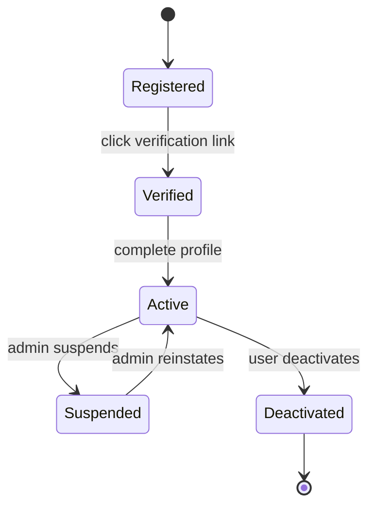
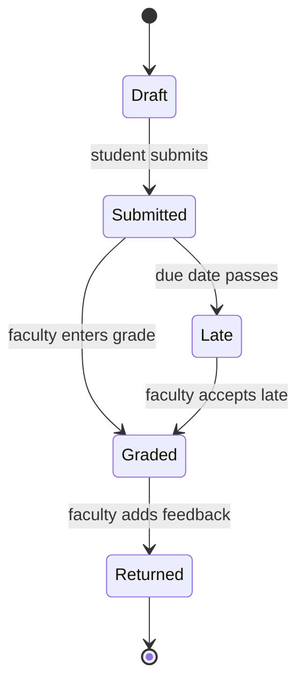
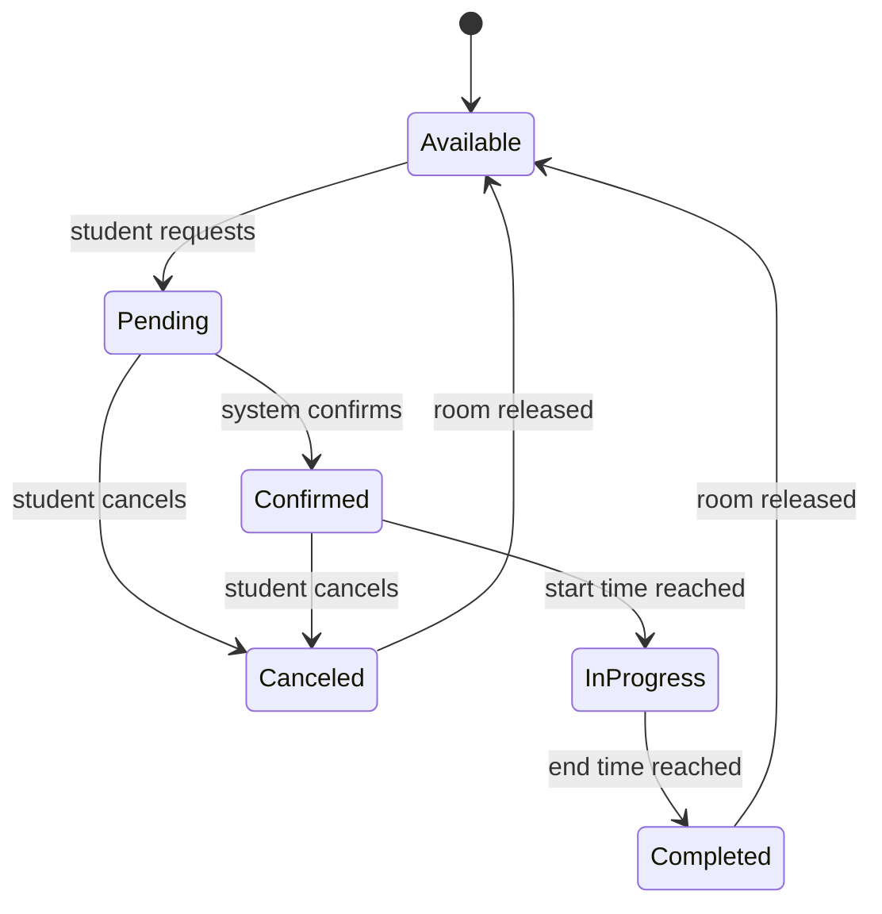
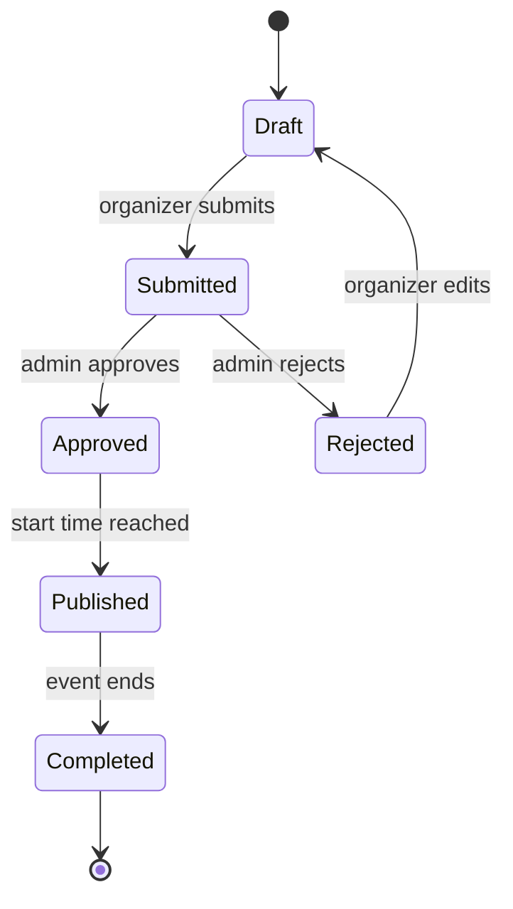
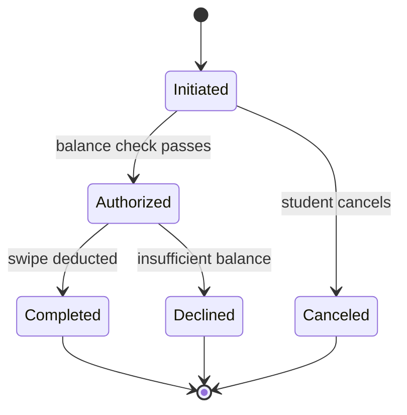
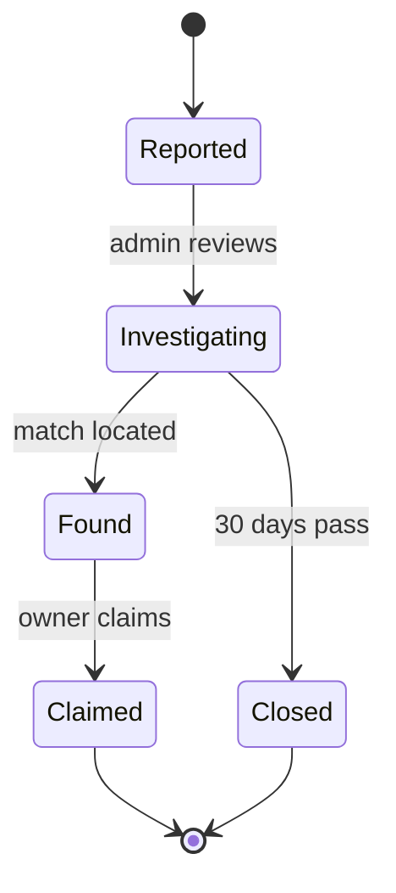
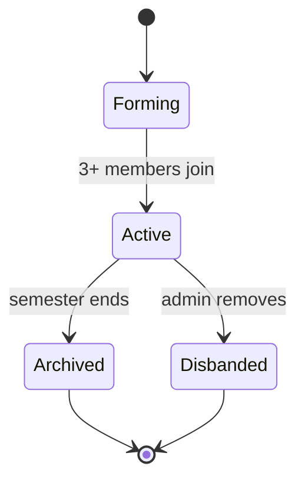
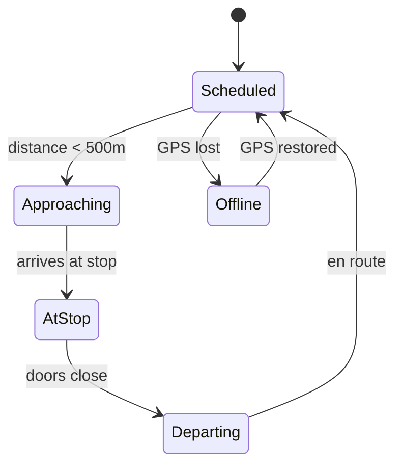

# State Transition Diagrams: Smart Campus Connect

---

## Object 1: User Account

### Diagram

Explanation
Key States and Transitions:

State	Description
Registered	User created account but email not verified
Verified	Email confirmed but profile incomplete
Active	Full access to system features
Suspended	Temporarily blocked by administrator
Deactivated	User voluntarily closed account
From	To	Event	Guard Condition
Registered	Verified	User clicks verification link	Link not expired (24 hours)
Verified	Active	User completes profile	All required fields filled
Active	Suspended	Admin clicks Suspend	Violation detected
Active	Deactivated	User clicks Deactivate	User confirms
Suspended	Active	Admin clicks Reinstate	Violation resolved
How this maps to Functional Requirements (Assignment 4):

FR-01 (User Registration): Registered → Verified transition

FR-02 (User Authentication): Active state allows login

FR-03 (Role-Based Access): Active state includes role assignment

How this maps to Use Cases (Assignment 5):

UC-001 (Register Account): Maps to Registered → Verified → Active path

How this maps to User Stories (Assignment 6):

US-001 (Student Registration): Registered → Verified → Active

US-002 (Student Login): Active state

US-003 (Faculty Login): Active state

How this maps to Sprint Tasks (Assignment 6):

T-001.1: Create users table

T-001.2: Create registration API endpoint

T-001.3: Add email validation for @mycput.ac.za

T-001.4: Implement email verification service

T-001.5: Create registration UI screen

## Object 2: Assignment Submission

### Diagram

Explanation
Key States and Transitions:

State	Description
Draft	Work saved but not officially submitted
Submitted	Assignment submitted before or on due date
Late	Assignment submitted after due date
Graded	Faculty has assigned a score
Returned	Student has received grade and feedback
From	To	Event	Guard Condition
Draft	Submitted	Student clicks Submit	File uploaded and validated (type, size ≤50MB)
Submitted	Late	Due date passes	Current date > assignment due date
Submitted	Graded	Faculty enters grade	Grade between 0 and max points
Late	Graded	Faculty clicks Accept Late	Faculty discretion
How this maps to Functional Requirements (Assignment 4):

FR-06 (Assignment Management): Complete submission lifecycle

How this maps to Use Cases (Assignment 5):

UC-002 (Submit Assignment): Draft → Submitted transition

How this maps to User Stories (Assignment 6):

US-006 (Submit assignments online): Draft → Submitted → Graded → Returned

How this maps to Sprint Tasks (Assignment 6):

T-006.1: Create submissions table

T-006.2: Implement file upload API

T-006.3: Add file validation (type, size)

T-006.4: Create submission UI screen

 ## Object 3: Study Room Booking

### Diagram

Explanation
Key States and Transitions:

State	Description
Available	Room is free to book
Pending	Booking request awaiting confirmation
Confirmed	Booking is locked and scheduled
InProgress	Current time is within booking window
Completed	Booking period has ended
Canceled	Booking was cancelled
From	To	Event	Guard Condition
Available	Pending	Student selects time slot	Time slot is free
Pending	Confirmed	System confirms	No overlapping bookings; max 3 hours
Pending	Canceled	Student cancels	-
Confirmed	InProgress	Start time reached	Current time ≥ booking start time
Confirmed	Canceled	Student cancels	Cancellation before start time
InProgress	Completed	End time reached	Current time ≥ booking end time
How this maps to Functional Requirements (Assignment 4):

FR-09 (Study Space Finder): Available → Pending → Confirmed transitions

How this maps to Use Cases (Assignment 5):

UC-005 (Find Study Space): Available → Pending → Confirmed

How this maps to User Stories (Assignment 6):

US-009 (Find study rooms): Available state

US-010 (Book study room): Pending → Confirmed transition

How this maps to Sprint Tasks (Assignment 6):

T-009.1: Create bookings table

T-009.2: Implement room availability API

T-009.3: Create booking API endpoint

T-009.4: Create booking UI screen

## Object 4: Event
### Diagram

Explanation
Key States and Transitions:

State	Description
Draft	Event being created, not yet submitted
Submitted	Awaiting admin approval
Approved	Admin approved, ready for publication
Rejected	Admin rejected with reason
Published	Visible to students for registration
Completed	Event has ended
From	To	Event	Guard Condition
Draft	Submitted	Organizer clicks Submit	All required fields filled
Submitted	Approved	Admin clicks Approve	No policy violations
Submitted	Rejected	Admin clicks Reject	Violation detected
Rejected	Draft	Organizer edits	Changes made based on rejection reason
Approved	Published	Start time reached	Current time ≥ event start time
Published	Completed	End time reached	Current time ≥ event end time
How this maps to Functional Requirements (Assignment 4):

FR-11 (Event Creation and Discovery): Draft → Submitted → Published

FR-12 (Event Approval Workflow): Submitted → Approved/Rejected

How this maps to Use Cases (Assignment 5):

UC-006 (Register for Event): Published state

UC-008 (Approve Event): Submitted → Approved transition

How this maps to User Stories (Assignment 6):

US-012 (Register for events): Published state

US-016 (Approve event submissions): Submitted → Approved transition

How this maps to Sprint Tasks (Assignment 6):

T-012.1: Create events table

T-012.2: Create event API endpoint

T-012.3: Create approval queue UI

T-012.4: Create event registration API

T-016.1: Create admin approval interface

## Object 5: Meal Plan Transaction
### Diagram

Explanation
Key States and Transitions:

State	Description
Initiated	Transaction started but not processed
Authorized	Balance check passed
Completed	Swipe successfully deducted
Declined	Insufficient balance
Canceled	Student cancelled before completion
From	To	Event	Guard Condition
Initiated	Authorized	System checks balance	Remaining swipes ≥ 1
Initiated	Canceled	Student clicks Cancel	-
Authorized	Completed	System deducts swipe	Transaction recorded
Authorized	Declined	System checks balance	Remaining swipes < 1
How this maps to Functional Requirements (Assignment 4):

FR-17 (Meal Plan Balance Tracking): Authorized → Completed updates balance

How this maps to User Stories (Assignment 6):

US-017 (View meal plan balance): Declined state triggers low balance alert

How this maps to Sprint Tasks (Assignment 6):

T-017.1: Create transactions table

T-017.2: Create balance API endpoint

T-017.3: Create transaction UI screen

## Object 6: Lost Item Report
### Diagram

Explanation
Key States and Transitions:

State	Description
Reported	Lost item report submitted
Investigating	Admin actively searching for matches
Found	Matching found item located
Claimed	Owner verified and item returned
Closed	Report expired after 30 days
From	To	Event	Guard Condition
Reported	Investigating	Admin clicks Review	Report is valid
Investigating	Found	System finds match	Match confidence > 80%
Investigating	Closed	30 days pass	No match found
Found	Claimed	Owner claims	Owner provides proof of ownership
How this maps to Functional Requirements (Assignment 4):

FR-15 (Lost Item Reporting): Reported state

FR-16 (Found Item Reporting): Investigating → Found transition

How this maps to User Stories (Assignment 6):

US-018 (Report lost item): Reported state

How this maps to Sprint Tasks (Assignment 6):

T-018.1: Create lost_items table

T-018.2: Create report API endpoint

T-018.3: Implement matching algorithm

## Object 7: Study Group
### Diagram

Explanation
Key States and Transitions:

State	Description
Forming	Group created, recruiting members
Active	Minimum members reached, group functioning
Archived	Group closed after semester ends
Disbanded	Admin removed due to violation
From	To	Event	Guard Condition
Forming	Active	Members join	Member count ≥ 3
Active	Archived	Semester ends	Current date > semester end date
Active	Disbanded	Admin clicks Disband	Policy violation detected
How this maps to Functional Requirements (Assignment 4):

FR-13 (Study Group Creation): Forming state

FR-14 (In-App Messaging): Active state enables messaging

How this maps to Use Cases (Assignment 5):

UC-007 (Create Study Group): Forming → Active transition

How this maps to User Stories (Assignment 6):

US-013 (Create study groups): Forming state

US-014 (Send messages): Active state

How this maps to Sprint Tasks (Assignment 6):

T-013.1: Create groups table

T-013.2: Create group API endpoint

T-013.3: Create messaging API

## Object 8: Shuttle Location Update
### Diagram

Explanation
Key States and Transitions:

State	Description
Scheduled	Shuttle on route, on time
Approaching	Within 500m of next stop
AtStop	Shuttle stopped at location
Departing	Leaving stop
Offline	GPS signal lost
From	To	Event	Guard Condition
Scheduled	Approaching	GPS update received	Distance to next stop < 500 meters
Approaching	AtStop	Shuttle arrives	Speed = 0 at stop coordinates
AtStop	Departing	Timer expires	30 seconds elapsed for boarding
Departing	Scheduled	GPS update received	Moving toward next stop
Scheduled	Offline	Signal loss	No GPS update for 10 seconds
Offline	Scheduled	Signal restored	Valid coordinates received
How this maps to Functional Requirements (Assignment 4):

FR-10 (Shuttle Tracking): All states enable real-time tracking

How this maps to User Stories (Assignment 6):

US-011 (Track campus shuttles): Scheduled and Approaching states show ETA

How this maps to Sprint Tasks (Assignment 6):

T-011.1: Create shuttle_locations table

T-011.2: Integrate GPS API

T-011.3: Create real-time tracking UI

---
