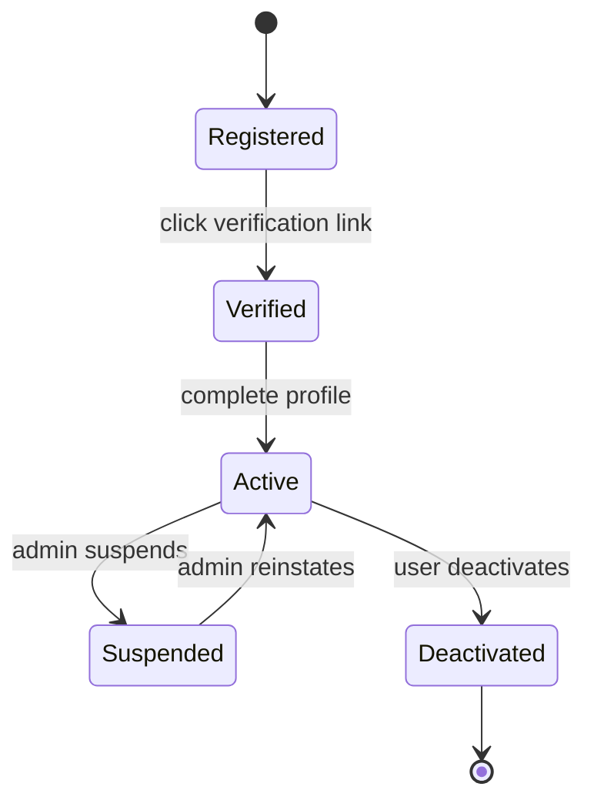
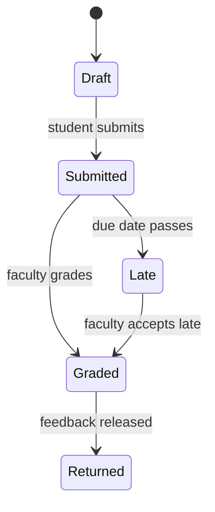
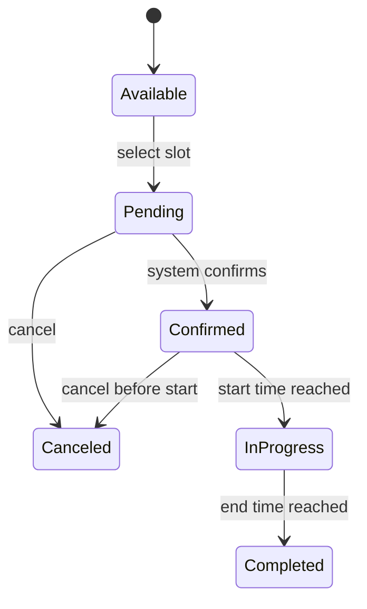
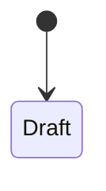

# State Diagrams and Tables

---

## Object 1: User Account

| State       | Description                                 |
| ----------- | ------------------------------------------- |
| Registered  | User created account but email not verified |
| Verified    | Email confirmed but profile incomplete      |
| Active      | Full access to system features              |
| Suspended   | Temporarily blocked by administrator        |
| Deactivated | User voluntarily closed account             |

| From       | To          | Event                         | Guard Condition             |
| ---------- | ----------- | ----------------------------- | --------------------------- |
| Registered | Verified    | User clicks verification link | Link not expired (24 hours) |
| Verified   | Active      | User completes profile        | All required fields filled  |
| Active     | Suspended   | Admin clicks Suspend          | Violation detected          |
| Active     | Deactivated | User clicks Deactivate        | User confirms               |
| Suspended  | Active      | Admin clicks Reinstate        | Violation resolved          |

---

## Object 2: Assignment Submission

| State     | Description                                |
| --------- | ------------------------------------------ |
| Draft     | Work saved but not officially submitted    |
| Submitted | Assignment submitted before or on due date |
| Late      | Assignment submitted after due date        |
| Graded    | Faculty has assigned a score               |
| Returned  | Student has received grade and feedback    |

| From      | To        | Event                 | Guard Condition         |
| --------- | --------- | --------------------- | ----------------------- |
| Draft     | Submitted | Student clicks Submit | File validated (≤50MB)  |
| Submitted | Late      | Due date passes       | Current date > due date |
| Submitted | Graded    | Faculty enters grade  | Valid grade range       |
| Late      | Graded    | Faculty accepts late  | Faculty discretion      |
| Graded    | Returned  | Feedback released     | Feedback available      |

---

## Object 3: Study Room Booking

| State      | Description           |
| ---------- | --------------------- |
| Available  | Room is free to book  |
| Pending    | Awaiting confirmation |
| Confirmed  | Booking scheduled     |
| InProgress | Booking active        |
| Completed  | Booking finished      |
| Canceled   | Booking canceled      |

| From       | To         | Event           | Guard Condition    |
| ---------- | ---------- | --------------- | ------------------ |
| Available  | Pending    | Select slot     | Slot is free       |
| Pending    | Confirmed  | System confirms | No overlap, ≤3 hrs |
| Pending    | Canceled   | Cancel request  | -                  |
| Confirmed  | InProgress | Start time      | Current ≥ start    |
| Confirmed  | Canceled   | Cancel          | Before start       |
| InProgress | Completed  | End time        | Current ≥ end      |

---

## Object 4: Event

